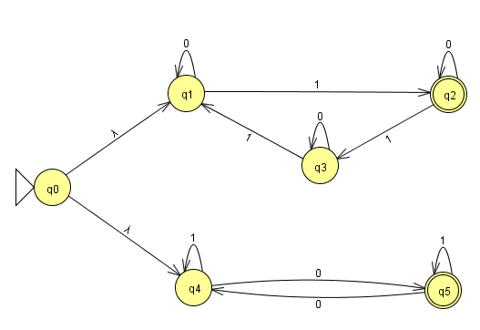
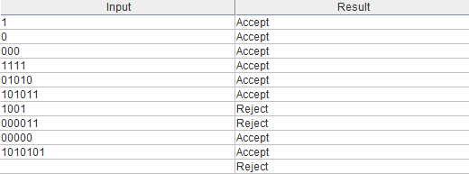
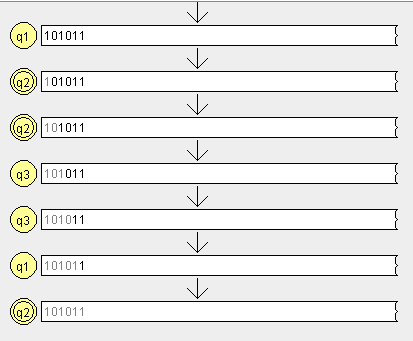

## NFA Number 20

# NFA Diagram

# Test Strings

# Gold St-ring
### For this question, I did not bump into any gold st-rings. Here is a sample string test for "101011" that was correctly accepted.

## Handwritten Computation

## JFLAP Transition

